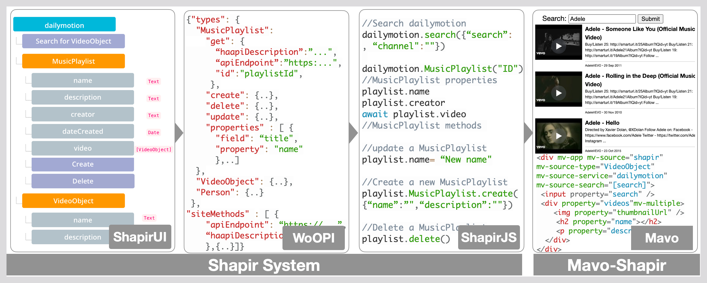
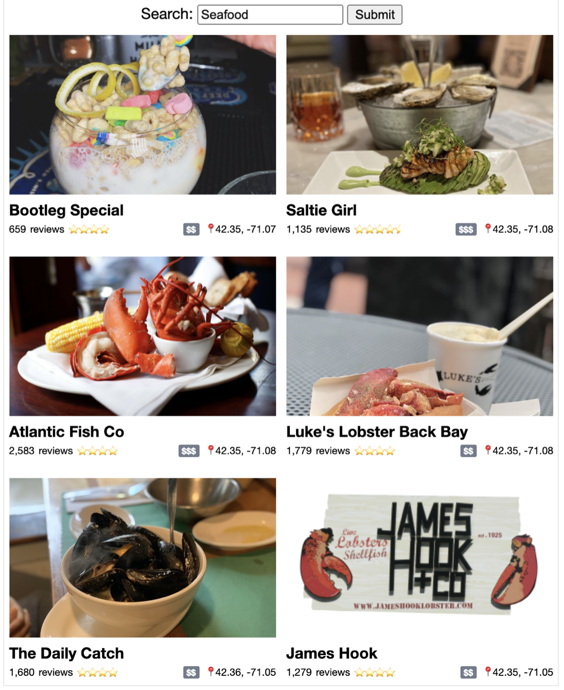

# Shapir
A tool that standardizes access to APIs and simplifies the work for users, even non-programmers, to create interactive web applications that operate on data accessible through arbitrary Web APIs.

https://shapir.org

<!--  -->


<!-- - Tool: https://shapir.org/
- Documentation: https://shapir.org/doc -->

## Overview
Shapir is an ecosystem that significantly simplifies the work for users, even non-programmers, to create interactive web applications that operate on standardized data accessible through arbitrary web APIs. It consists of three related components: **WoOPI**, **ShapirJS**, and **ShapirUI**. WoOPI is a novel standardized, machine-readable API ontology, which can be used to provide a description that wraps the API with objects conforming to the canonical type definitions provided by [Schema.org](https://schema.org). ShapirJS is a JavaScript library that uses a WoOPI description to present the API's data as typed objects in the local environment. And ShapirUI is a graphical tool that lets even non-programmers create the required WoOPI descriptions, using standard data types. These three components are connected. One uses ShapirUI to describe an API. ShapirUI then generates a corresponding WoOPI description that can be used by ShapirJS to generate a JavaScript client library for that API. We integrated ShapirJS with [Mavo](https://mavo.io), an interactive declarative HTML-based language, to empower a user to create applications interacting with APIs' data by writing only HTML, with no JavaScript programming required. Any API described once by WoOPI, can be used by all other users.


## JavaScript Library (ShapirJS)
- [Documentation](https://shapir.org/library)
- [Explore Websites](https://shapir.org/library#/explore)


### How to use ShapirJS

**Get Started**

```js
import shapir from "https://shapir.org/shapir.js";

shapir().then(async () => {
	//add your functions here
});
```

**Example Functions**

```js
// Get the playlist
let playlist = await vimeo.MusicPlaylist("8274189");
// Read playlist information
console.log(playlist.name, playlist.description, ...)

// Get the playlist videos
let videos = await playlist.video;

// Get the comments of the 5th video
let videoComments = await videos[4].comment;
```


```js
// Search Vimeo
videos = await vimeo.search("Adele", {sort:"relevant", filter:"trending", numberOfItems:200});
```


```js
// Create a new playlist
playlist = await vimeo.MusicPlaylist.create({name:"New", description:"New", layout:"player"});
```

```js
// Update the playlist's description
playlist.description = "Still New";
```

```js
// Delete the playlist
playlist.delete();
```


## HTML Library (Mavo-Shapir)
- [Documentation](https://shapir.org/mavo)
- [Explore Websites](https://shapir.org/mavo#/explore)


### How to use Mavo-Shapir

**Get Started**

```html
<head>
	...
	<script rel="stylesheet" src="https://get.mavo.io/mavo.css"></script>
	<script src="https://get.mavo.io/mavo.j"></script>
	<script type="module" src="https://shapir.org/mavo-shapir.js"></script>
	...
</head>
```

**Example Functions**

Read a playlist and its videos from Dailymotion
<table>
<tr>
<!-- <th>Json 1</th> -->
<!-- <th>Markdown</th> -->
</tr>
<tr width="100%">
<td width="62%">

```html
<div mv-app mv-source="shapir"
  mv-source-service="dailymotion"
  mv-source-type="MusicPlaylist"
  mv-source-id="[id]">
  <input property="id" />
  <h1 property="name"></h1>
  <article property="video" mv-multiple>
    <h2 property="name"></h2>
    <p property="description"></p>
    
    <iframe src="[embedUrl]"></iframe>
  </article>
</div>
```
</td>
<td>

</td>
</tr>
</table>


Search a Yelp and Foursquare for restaurants


<table>
<tr>
<!-- <th>Json 1</th> -->
<!-- <th>Markdown</th> -->
</tr>
<tr width="100%">
<td width="62%">

```html
<div mv-app mv-source="shapir"
  mv-source-search="[search]"
  mv-source-service="yelp, foursquare">
  <input property="search" />
  <div property="businesses" mv-multiple>
    
    <h2 property="name"></h2>
    <span property="reviewCount"></span>
    <span property="aggregateRating"></span>
    <span property="priceRange"></span>
    <span property="latitude"></span>,
    <span property="longitude"></span>
  </div>
</div>
```
</td>
<td>

</td>
</tr>
</table>


